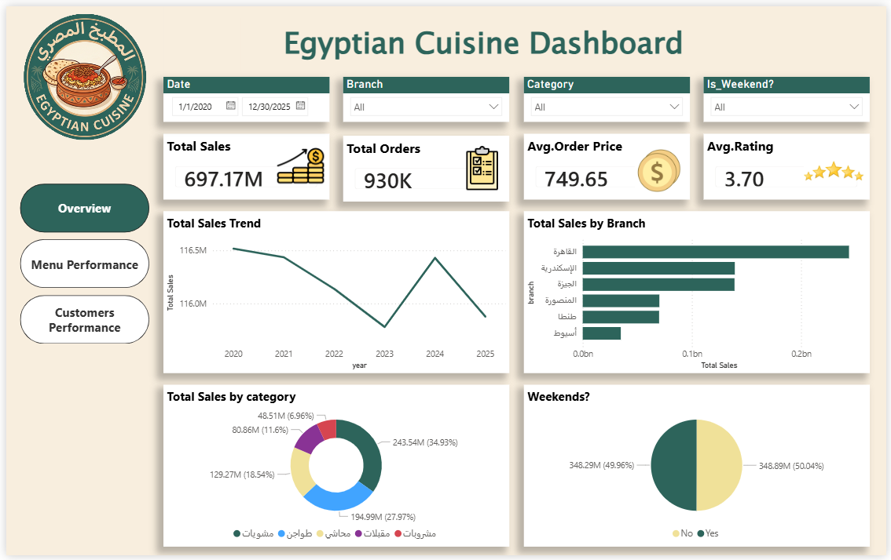
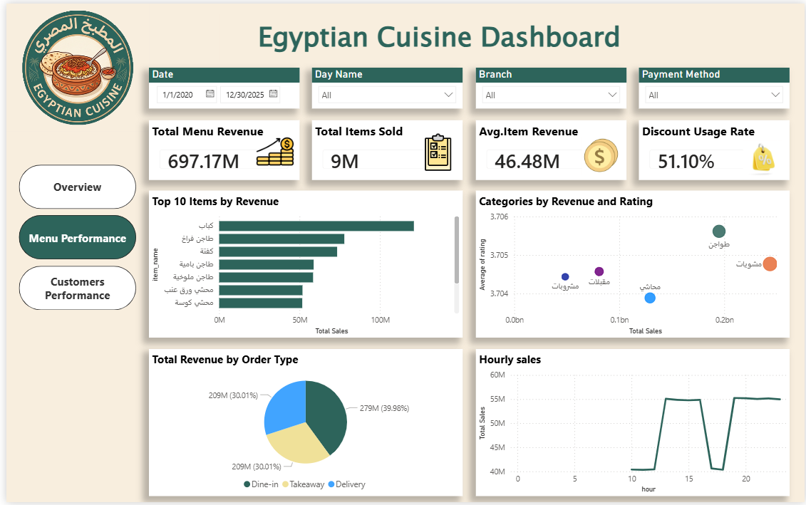
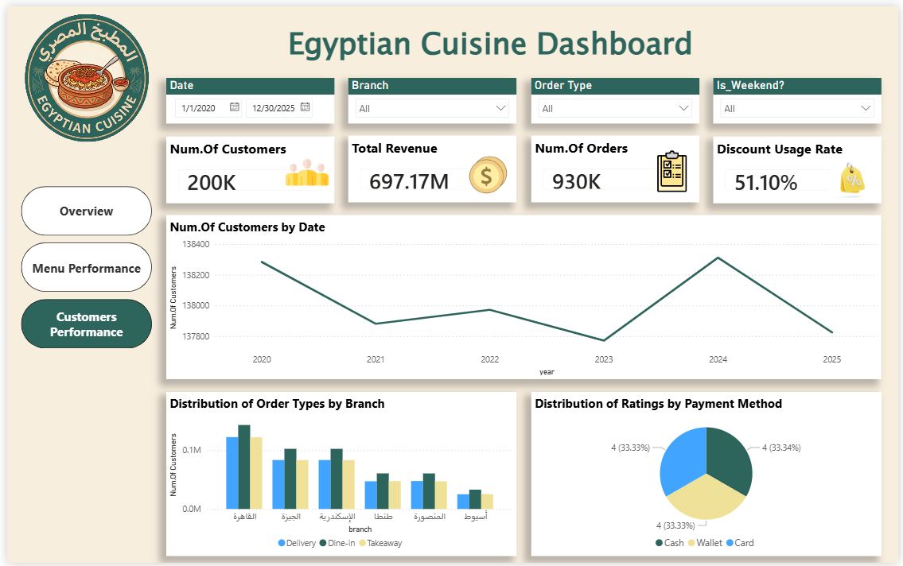

# 🍽️ Restaurant Big Data Analytics

## 📖 Project Overview

This project analyzes a large-scale restaurant dataset containing **over 2.6 million rows** using Databricks and Power BI. The goal is to extract actionable business insights and present them through an interactive dashboard.

The project demonstrates:
- Big Data processing and data transformation  
- Feature engineering to enhance temporal analysis  
- Direct connection to Power BI for live interaction  
- Data-driven insights for operational improvements  

---

## ⚙️ Tools & Technologies

- Databricks (SQL)  
- Power BI  
- DirectQuery for handling large-scale data  

---

## 📊 Dataset

- Source: AI-generated dataset  
- Size: **2.6+ million rows**  

### Columns in the Dataset

- `branch` → restaurant branch  
- `category` → item category  
- `customer_id` → unique customer identifier  
- `discount` → discount applied  
- `hour` → order hour  
- `is_weekend` → weekend indicator (0/1)  
- `item_name` → item name  
- `order_date` → order date  
- `order_id` → order identifier  
- `order_type` → dine-in / delivery / takeaway  
- `payment_method` → payment type  
- `price` → item price  
- `quantity` → quantity sold  
- `rating` → customer rating  
- `total_amount` → total order value  

### Engineered Columns

- `year` → extracted from order date  
- `month` → extracted from order date  
- `day_name` → day of the week  
- `month_name` → formatted month  
- `weekend_flag` → Yes / No  
- `day_number` → numeric day of week  

---

## 🧱 SQL Data Processing

Key steps performed in Databricks to prepare the dataset:

1. **Merging datasets**  
   Combine the two JSON files into a unified table:
   ```sql
   CREATE TABLE restaurant_bronze AS 
   SELECT * FROM restaurant1
   UNION ALL
   SELECT * FROM restaurant2;

2. **Feature Engineering**
   Enhance temporal analysis by adding new columns:
   ```sql
   ALTER TABLE restaurant_bronze
   ADD COLUMNS (year INT, month INT, day_name STRING);

   UPDATE restaurant_bronze
    SET year = year(order_date),
    month = month(order_date),
    day_name = date_format(order_date, 'EEEE');

3. **Final Table Creation**
  Prepare the table for Power BI dashboards:
   ```sql
   -- Create final table for Power BI
   CREATE OR REPLACE TABLE restaurant AS
   SELECT *,
       date_format(order_date, 'MMM') AS month_name
   FROM restaurant_bronze;

   -- Add additional columns
   ALTER TABLE restaurant
   ADD COLUMNS (weekend_flag STRING, day_number INT);

   -- Update new columns
   UPDATE restaurant
   SET weekend_flag = CASE WHEN is_weekend = 1 THEN 'Yes' ELSE 'No' END,
    day_number = dayofweek(order_date);

** These steps ensure the dataset is clean, enriched, and ready for visualization in Power BI.**

---

## 📊 Dashboard Preview

The interactive dashboard consists of three pages to analyze restaurant performance:

### 🟢 Overview Page


Includes:
- Total Sales  
- Total Orders  
- Average Order Price  
- Average Rating  
- Sales Trend  
- Sales by Branch & Category  
- Weekend vs Weekday analysis  

### 🍽️ Menu Performance


Includes:
- Top 10 Items by Revenue  
- Item Revenue Analysis  
- Discount Usage Rate  
- Sales by Order Type  
- Hourly Sales Trends  

### 👥 Customer Performance


Includes:
- Number of Customers  
- Number of Orders  
- Revenue Trends  
- Customer Behavior Analysis  
- Ratings Distribution  

---

## 📊 Key Insights
* Slight decline in sales is driven by reduced customer count and order volume
* Top-performing menu items remain stable over time
* Average rating (3.7) indicates moderate customer satisfaction
* Discount usage shows minimal impact on purchasing behavior
* Sales patterns remain consistent across weekdays and weekends
* Peak sales hours occur during lunch (13:00–16:00) and dinner (19:00–23:00)

---

## 💡 Recommendations

* Improve customer experience to increase retention
* Redesign discount strategies for better effectiveness
* Focus on retaining existing customers
* Investigate underperforming branches for operational improvements

---

## ⚠️ Disclaimer

This dataset is AI-generated and used for demonstration purposes to showcase data analysis, feature engineering, and dashboard visualization skills.
